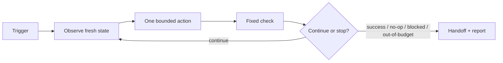

# Loop engineering — the discipline

> You shouldn't be prompting coding agents anymore. You should be designing loops
> that prompt your agents. — Peter Steinberger
>
> I don't prompt Claude anymore. I have loops running that prompt Claude … My job
> is to write loops. — Boris Cherny

This repo is built on **loop engineering**: designing the autonomous control
system around an agent, instead of typing every prompt by hand.

## The three-layer stack

| Layer                  | What you optimize                                    | Unit of work                          |
| ---------------------- | ---------------------------------------------------- | ------------------------------------- |
| Prompt engineering     | how you phrase one instruction                       | one turn you type by hand             |
| Context engineering    | what else is in the window (docs, history, tools)    | the conditions around one answer      |
| **Loop engineering**   | the system that decides what to prompt, when, & pass/fail | a self-running cycle across many turns |

The lower layers don't disappear — a sloppy prompt inside a loop just produces
sloppy work faster. Loop engineering adds the autonomous control structure around
all of it.

## Inner loop vs. outer loop

- **Inner loop** — what a coding agent already does each turn: perceive → reason
  → act (tool/edit/test) → observe → reason again. The harness provides this; you
  don't build it.
- **Outer loop** — the system that runs the inner loop on a schedule, feeds it
  work, checks the result, and decides what's next *without you typing each
  prompt*. **That is what this repo is.**

## Where it came from — the lineage

| Stage           | What it was                                              | What it added                         |
| --------------- | ------------------------------------------------------- | ------------------------------------- |
| ReAct (2022)    | reason → act → observe → repeat, a human watching       | one model, one loop                   |
| AutoGPT (2023)  | gave the loop a goal, let it prompt itself              | autonomy (and infinite spinning)      |
| **Ralph (2025)**| a bash loop piping the same prompt, fresh context/pass  | discipline: reset context to anchors  |
| `/goal` (2026)  | Ralph productized; runs until a validator model agrees  | a built-in verifiable stop            |
| Orchestration   | loops supervising loops, scheduled, git-backed state    | the loop becomes the unit of work     |

Geoffrey Huntley's **Ralph technique** is the seed: run a coding agent in a plain
loop, with a *fresh context every pass* that reads the current repo state and task
list from disk, does exactly one unit of work, commits, and exits. The
intelligence lives in clear specs and verifiable outcomes applied over and over —
not in one heroic session. This repo is Ralph, productized: `scripts/loop.sh` is
the `while` loop, `specs/` + `memory/` are the external memory, and
`scripts/verify.sh` is the validator stop.

## Why fresh context matters

A long session degrades as the window fills with old reasoning, dead ends, and
stale file contents ("context rot"). Resetting to a fixed set of anchor files each
pass sidesteps that: every iteration is a clean slate that re-reads the truth from
disk. **The agent forgets; the repo doesn't.**

## Why it matters now

The bottleneck is no longer writing code — it's specifying the goal and the check
precisely enough that an agent can run unattended and you can trust the result.
The agentic loop is the format that encodes exactly those two things. And agents
get dramatically more reliable when they can verify their own work — so build
everything so the agent can check itself (run the CLI, run the test, hit the
endpoint, diff the screenshot). **Close the loop.**

## Read next

- `docs/loop-library.md` — how to author loops; the starter library in `loops/`.
- `docs/guardrails.md` — the non-negotiable safety rules and hard stops.
- `docs/maturity-ladder.md` — how to adopt loops safely, one rung at a time.
- `AGENTS.md` — the operational instructions every agent follows here.
